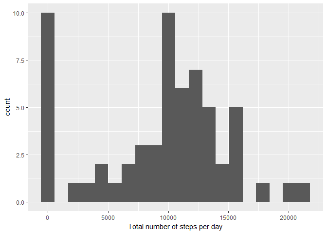
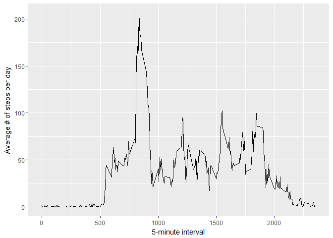
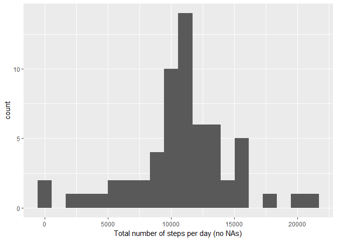
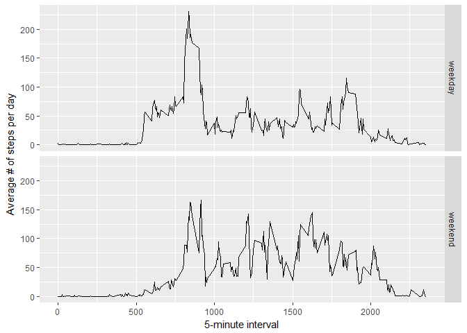

# Reproducible Research: Peer Assessment 1

## Loading the libraries

```r
library(dplyr)
library(ggplot2)
```

## Loading and preprocessing the data
Load the data from repo and format the date variable.

```r
activity <- read.csv("activity.csv", sep=",")
activity$date <- as.Date(activity$date)
```

## What is mean total number of steps taken per day?
1. Calculate the total number of steps taken per day

```r
activityDay <- activity %>%
        group_by(date) %>%
        summarise(steps = sum(steps,na.rm=T))
```

2. Make a histogram of the total number of steps taken each day

```r
qplot(activityDay$steps,xlab = "Total number of steps per day", bins = 20)
```

<!-- -->

3. Calculate and report the mean and median of the total number of steps taken per day

```r
mean(activityDay$steps,na.rm = T)
```

```
## [1] 9354.23
```

```r
median(activityDay$steps,na.rm = T)
```

```
## [1] 10395
```

## What is the average daily activity pattern?
1. Make a time series plot of the 5-minute interval (x-axis) and the average number of steps taken, averaged across all days (y-axis)

```r
ggplot(data=activity)+
        stat_summary(aes(x=interval,y=steps,group=1),
                     fun.y = "mean",na.rm=T,geom = "line")+
        xlab("5-minute interval")+
        ylab("Average # of steps per day")
```

<!-- -->

2. Which 5-minute interval, on average across all the days in the dataset, contains the maximum number of steps

```r
activityInterval <- activity %>%
        group_by(interval) %>%
        summarise(stepsMean = mean(steps,na.rm=T))
activityInterval[which.max(activityInterval$stepsMean),] 
```

```
## # A tibble: 1 × 2
##   interval stepsMean
##      <int>     <dbl>
## 1      835  206.1698
```


## Imputing missing values
1. Calculate and report the total number of missing values in the dataset

```r
sum(is.na(activity$steps))
```

```
## [1] 2304
```

2. Devise a strategy for filling in all of the missing values in the dataset. 
3. Create a new dataset that is equal to the original dataset but with the missing data filled in.

```r
activityFull <- activity
for (i in levels(as.factor(activityInterval$interval))) {
        activityID <- activity$interval == i & is.na(activity$steps)
        activityFull$steps[activityID] <-
                activityInterval$stepsMean[activityInterval$interval == i]
}
```
Missing values are imputed using the mean number of steps for an interval.

4. Make a histogram of the total number of steps taken each day and calculate and report the mean and median total number of steps taken per day.

```r
activityFullDay <- activityFull %>%
        group_by(date) %>%
        summarise(steps = sum(steps,na.rm=T))


qplot(activityFullDay$steps,xlab = "Total number of steps per day (no NAs)", bins = 20)
```

<!-- -->

```r
mean(activityFullDay$steps)
```

```
## [1] 10766.19
```

```r
median(activityFullDay$steps)
```

```
## [1] 10766.19
```
Replacing missing values by a mean number of steps for a given  interval made the data more normally distributed with median and mean being the same.

## Are there differences in activity patterns between weekdays and weekends?
1. Create a new factor variable in the dataset with two levels – “weekday” and “weekend”

```r
is.weekend <- function(x) {
        y <- rep("",length(x))
        weekdays1 <- c("Monday","Tuesday","Wednesday","Thursday","Friday")
        y[weekdays(x) %in% weekdays1] <- "weekday"
        y[!weekdays(x) %in% weekdays1] <- "weekend"
        as.factor(y)
}
activityFull$dayType <- is.weekend(activityFull$date)
```

2. Make a panel plot containing a time series plot (i.e. type = "l") of the 5-minute interval (x-axis) and the average number of steps taken, averaged across all weekday days or weekend days (y-axis)

```r
activityFullInterval <- activityFull %>%
        group_by(interval,dayType) %>%
        summarise(steps = mean(steps))

ggplot(data=activityFullInterval, aes(x=interval,y=steps, group=1))+
        geom_line()+
        facet_grid(dayType~.)+
        xlab("5-minute interval") +
        ylab("Average # of steps per day")
```

<!-- -->
